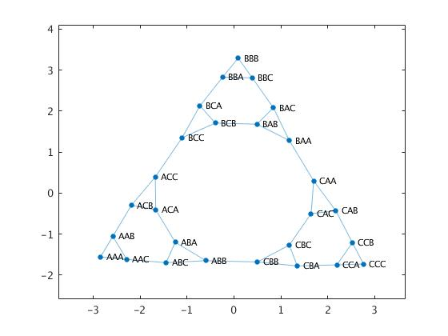
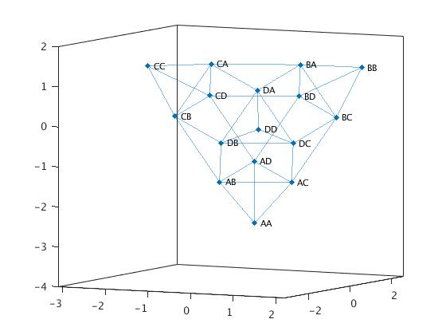
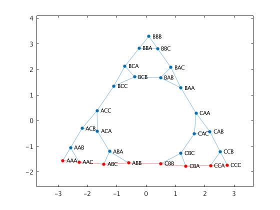

# Hanoi Matlab

A simple function that generates a graph object of the possible moves in a game of Hanoi with `numOfPegs` pegs and `numOfDisks` disks.

## Explanation of the graph
Each node represents a possible state of the Hanoi game and each node is represented by a string with `numOfDisks` characters where the `k`-th element represents the position of the `k`-th biggest disk, so ABC means the biggest disk is on the first peg, the second biggest is on the second one and the smallest one is on the third peg.

Each edge represents a valid move in the game.

## Examples

### 2D Graph
```
G = hanoi(3, 3);
plot(G);
```



### 3D Graph
```
G = hanoi(2, 4);
p = plot(G);
layout(p, 'force3');
view(3);
```



### Shortest path
```
G = hanoi(3, 3);
p = plot(G);
path = shortestpath(G, 'AAA', 'CCC');
highlight(p, path, 'NodeColor', 'r', 'EdgeColor', 'r');
```


